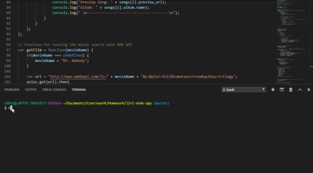
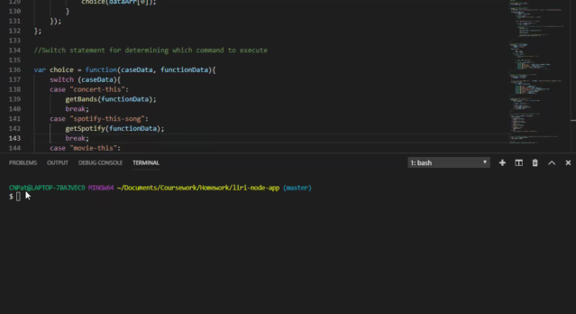
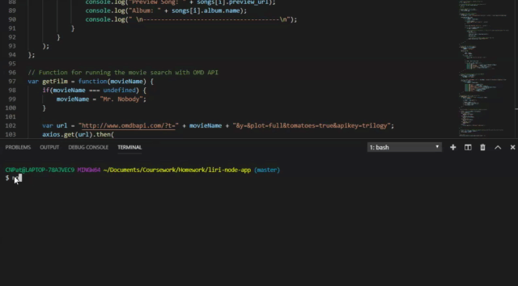
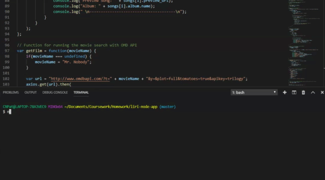

# liri-node-app

### Liri Node App

Liri Node App is a command line node application which takes in user input and returns songs, movie information,  and concert information. 

### How to Use
To use Liri: 

* Clone this repository
* Run command "npm install" in Terminal
* Run command "node liri.js" and one of the following commands: 
    * spotify-this-song <song title> will display information about the songs such as title, artist, album name, and a preview link.
    * concert-this <band / artist name> will display upcoming concert infomation for the listed artist.
    * movie-this <movie title> will display information about the film such as Rotten Tomatoes rating, year, plot, and actors.
    * do-what-it-says which takes the information in random.txt and executes it. 

### Tech Used
* Node.js
* Spotify NPM Package
* Request NPM Package
* Moment NPM Package
* Axios NPM Package
* Dotenv NPM Package
* OMDB API
* Bands In Town API

### The App in Action

* Spotify-this-song: 
Here is a preview of the spotify-this-song function

* Concert-this: 
Here is a preview of the concert-this function

* Movie-this:
Here is a preview of the movie-this function

* Do-what-it-says
Here is a preview of the do-what-it-says function

